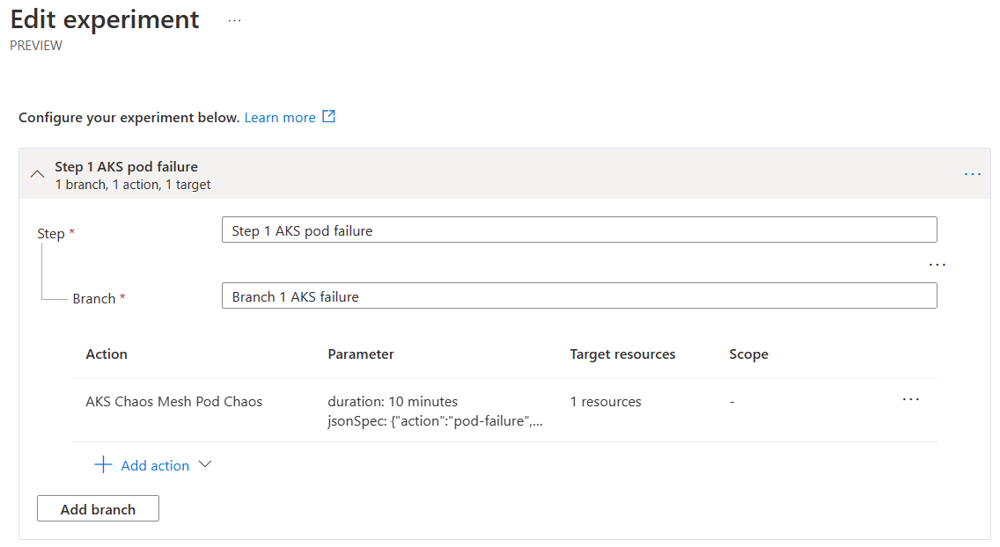
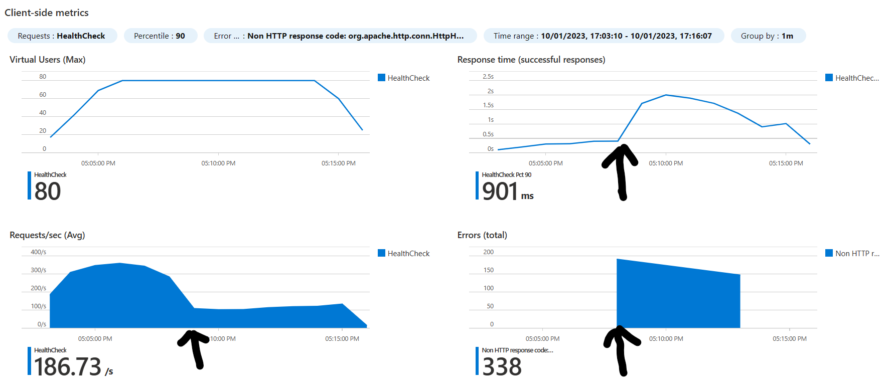

# Chaos Studio Experiments with Azure Load Testing

[Azure Chaos Studio]( https://learn.microsoft.com/en-us/azure/chaos-studio/chaos-studio-overview) is a new Azure tool for inducing faults in a target to allow you to really test how well an application or service copes with issues, specific outages, high CPU, low memory etc. This has often been difficult to test in a consistent way, so often development teams do not do this form of testing. This can lead to services being deployed that do not survive outages. Chaos Studio allows you to run "experiments" against a service (it must be emphasised that this should only be a test service) and see how it reacts to these experiments.

[Azure Load Testing](https://learn.microsoft.com/en-us/azure/load-testing/overview-what-is-azure-load-testing) is a Azure's managed load testing service. This allows you to drive load into a service to see how it responds to high levels of load. Load testing really should be performed on all applications and Azure Load Testing simplifies the process of provisioning load test infrastructure and managing a series of tests and their results.

It is therefore natural to combine the use of both of these tools to test how an application or service copes with a problem when running at scale.

This repository is a workshop that combines the use of Chaos Studio with Azure Load Testing against an AKS-hosted API with Cosmos Database as its backend. The repository contains the code for the API and details how to deploy this to Azure and to then run combined chaos experiments alongside load tests to see the impact of an issue under load.

## Quick Links
1. [Experiment one AKS pod failure](experiment-one.md).
2. [Experiment two Cosmos database issues](experiment-two.md).
2. [Experiment three AKS node pool issues](experiment-three.md).


# Here is a taster of an experiment

The chaos experiment below, stops one of three pods for the application API that will be load tested.



This results in one pod in the cluster failing


When load testing, when the chaos experiment kicks in, the request rate of the API falls and also the response time increases. There are a few errors too!



## Overall Workshop Structure

1. Deploy the sample app into an AKS cluster.
2. Install Chaos mesh into the AKS cluster
3. Enable Chaos Studio for AKS and Cosmos
4. Build a Chaos Experiment
5. Provision a load test service
6. Configure a load test using the JMeter (JMX) test provided
7. Run a chaos experiment
8. Run a load test
9. Analysis results
10. Later run other Chaos experiments

## Getting Started

The bulk of the effort for this workshop is setting up the system under test. This has been chosen as an AKS-hosted API because Kubernetes has a chaos mesh that then can be controlled from chaos experiments in a granular way. Likewise Cosmos database has some chaos capability.

Rather than build an application from scratch, the one in this repository has been forked from [Humongous Healthcare sample app](https://github.com/microsoft/winwithappplatpoc/blob/main/Hands-On%20Lab.md#overview) Specifically, this workshop only needs the API part of the application and the instructions to install it are [here](https://github.com/microsoft/winwithappplatpoc/blob/main/Hands-On%20Lab.md#exercise-2--review-and-publish-the-humongous-healthcare-web-api-service). Tasks 1 - 4 are only needed.

As the guide suggests, test that your API works by performing a POST HTTP reuqest with a JSON body and then some GET HTTP requests to establish the API works and is storing the payloads in Cosmos database.

POST a JSON message
```
POST http://<your-service-ip-address>/HealthCheck
Content-Type: application/json

{
    "patientid": 5,
    "date": "2021-09-08T00:41:49.9602636+00:00",
    "healthstatus": "I feel healthy",
    "symptoms": [
        "Hair regrowth",
        "Ennui"
    ]
}
```

GET all messages
```
GET http://<your-service-ip-address>/HealthCheck
```
You can test this API using any tool you feel comfortable with, such as Postman or my current favourite the [REST Client](https://marketplace.visualstudio.com/items?itemName=humao.rest-client) in Visual Studio code. 

### Install Chaos Mesh on your AKS Cluster

Once you are satisfied that the APIs work corretly in AKS, we are onto the Chaos installation parts. 

First [install Chaos Mesh onto the AKS Cluster ](https://learn.microsoft.com/en-us/azure/chaos-studio/chaos-studio-tutorial-aks-portal#set-up-chaos-mesh-on-your-aks-cluster)

### Enable Chaos Studio in AKS

This is standard configuration and is [enabling AKS as one of the Chaos targets](https://learn.microsoft.com/en-us/azure/chaos-studio/chaos-studio-tutorial-aks-portal#enable-chaos-studio-on-your-aks-cluster)

### Enable Chaos for Cosmos too

This is a question of choosing the Cosmos instance using the same steps as for AKS in the preceding section.

### Provision an Azure Load Testing service

Azure Load Testing is a normal Azure service. Provision it by giving it a name and preferably choosing the same region as the test application, there are limited regions for Azure Load Testing as it is in preview, so choosing one nearer will be better for testing if the same region is not available.

The steps are explained [here](https://learn.microsoft.com/en-us/azure/load-testing/quickstart-create-and-run-load-test#create-an-azure-load-testing-resource)

## Summary

You should now have a test application (web API) in AKS that uses a Cosmos database. You should also now have Chaos Studio configured and ready to run experiments, plus a means of load testing to see what effect a Chaos experiment has on the application.

So, let's move to do the [first experiment](experiment-one.md).
