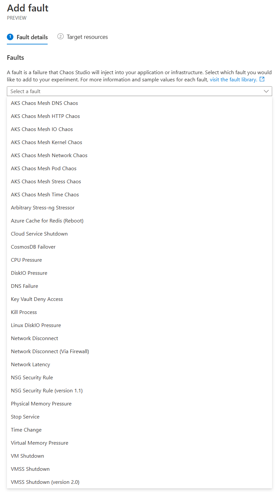

# Conclusions

Azure Chaos Experiments and Load Testing are two services that together provide a lot of insight into the performance and resilience of your workloads. Using these together allows a product team to assess how well an application performs under various failure modes, which has been difficult to do historically.

This opens up a new capability for application/product or SRE teams to actually test under repeatable conditions how an application reacts to failure. This should allow the architects, designers and coders to improve their applications.

As a final reminder, it is not advised to do chaos testing against a production workload.

## Future Experiments

Our chaos experiments in this workshop have been simple in the sense that a single fault has been injected. Chaos Studio allows an experiment to be built up of a number of steps and branches - these can be faults, but also delays. This allows the design of much more complex experiments where a number of faults or pressures can be applied to an application in parallel or a sequence.

Below is a list of the different chaos actions at the time of writing:

These can all be used in experiments and in combination. There are a large number of AKS fault types because these lever off a chaos mesh being installed into the AKS cluster. There are also quite a number of infrastructure or *control plane* faults. 
