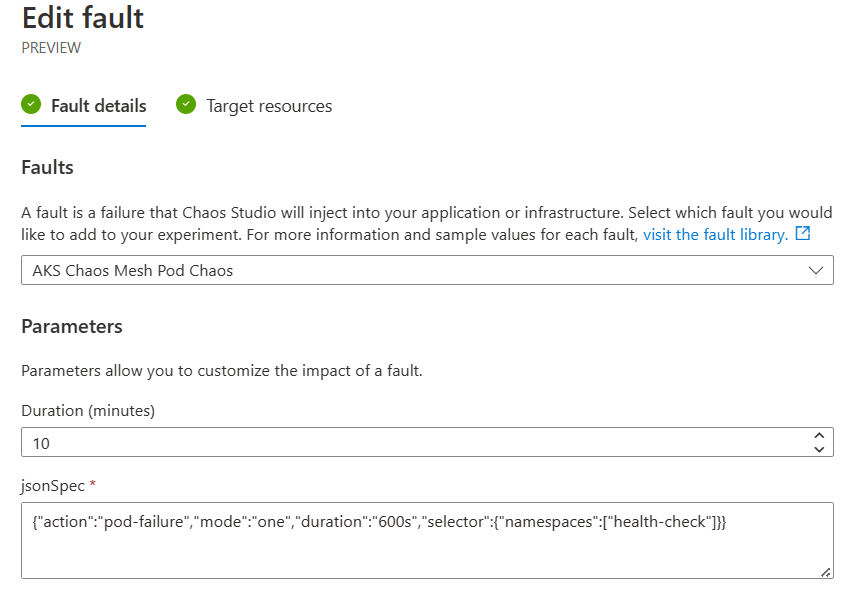

# Chaos Experiment One

In this experiment we going to cause some of the pods to fail on the AKS cluster. We can then use our Azure Load Testing service to then run load tests:

1. before the experiment starts - to get a baseline
2. during the middle of a load test - to see how the experiment impacts a busy service
3. for the full duration of a load test - to get a better feel of the overall loss in performance

## Set up the Chaos Experiment

This process essentially follows [this guide](https://learn.microsoft.com/en-us/azure/chaos-studio/chaos-studio-tutorial-aks-portal#create-an-experiment)

This creates a simple experiment with one step with a single branch and action. 


and the fault details to run an AKS Chaos Messh Pod Chaos fault for 10 minutes:


The action is the important part
```
{"action":"pod-failure","mode":"one","duration":"600s","selector":{"namespaces":["health-check"]}}
```

What the above script does is to target pods in the *health-check* namespace and the *mode* is to fail *one* pod. There are many other ways of defining this fault. See the chaos mesh [documentation](https://chaos-mesh.org/docs/simulate-pod-chaos-on-kubernetes/#create-experiments-using-yaml-configuration-files). 

## Set up the Load Test 

## Perform test runs

### Run one - before the chaos experiment starts


### Run two - during a load test


### Run three - for the full duration of a load test


## Observations and Conclusions


[Experiment two](experiment-two.md)
