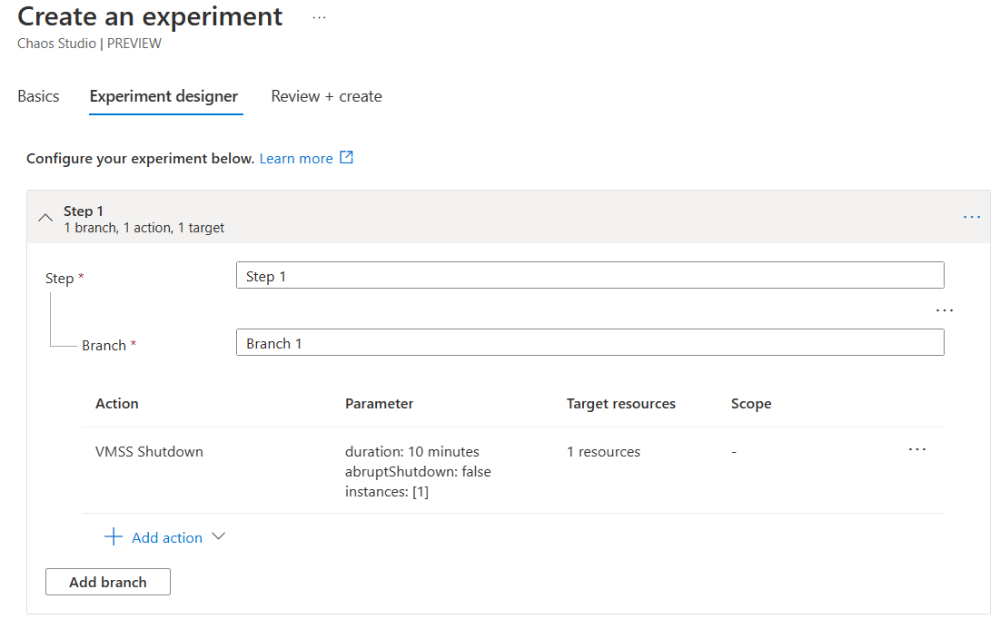
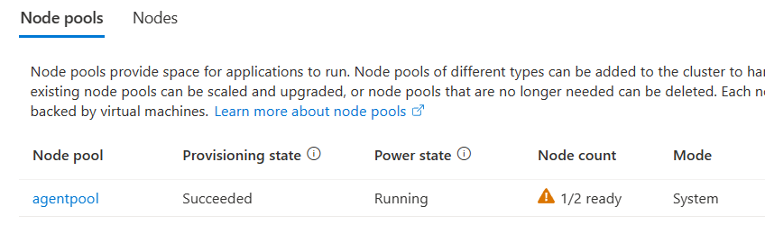
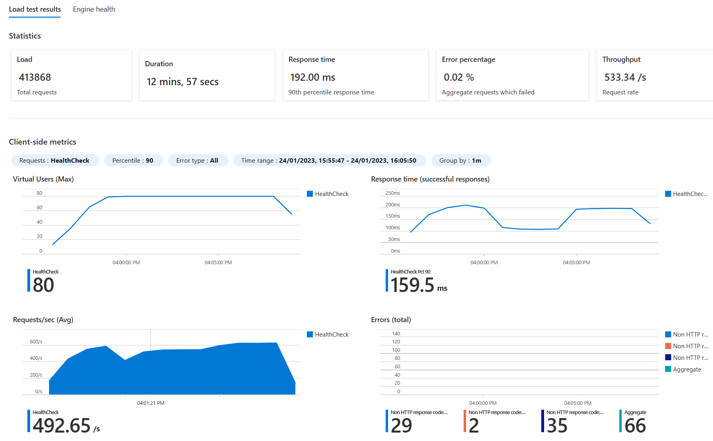

# Chaos Experiment Three

In this experiment we going to cause an issue with the node pool that the AKS cluster uses. We can then use our Azure Load Testing service to then run load tests:

1. before the experiment starts - to get a baseline
2. during the middle of a load test - to see how the experiment impacts a busy service
3. for the full duration of a load test - to get a better feel of the overall loss in performance

## Set up the Chaos Experiment

This chaos experiment uses the *VMSS Shutdown* fault. This allows you to designate the VMSS and how many of the instances in the pool get shutdown. 

This experiment only works well if there is more than one node in the node pool - otherwise the application (when on a single AKS cluster with a single node pool) will not work at all. A much more interesting experiment is a partial failure.

## Set up the Load Test 

No need to setup the load test, but it is useful to use the feature in load test that allows you to comment a run, so for a specific load test the purpose of the run can be recorded for later.

## Perform test runs

You can check that the experiment is having an effect on the cluster by looking at the node pools part of the the AKS instance in the portal. It should show one of the node pools not being available:

### Run one - before the chaos experiment starts

### Run two - during a load test

### Run three - for the full duration of a load test

## Observations and Conclusions

