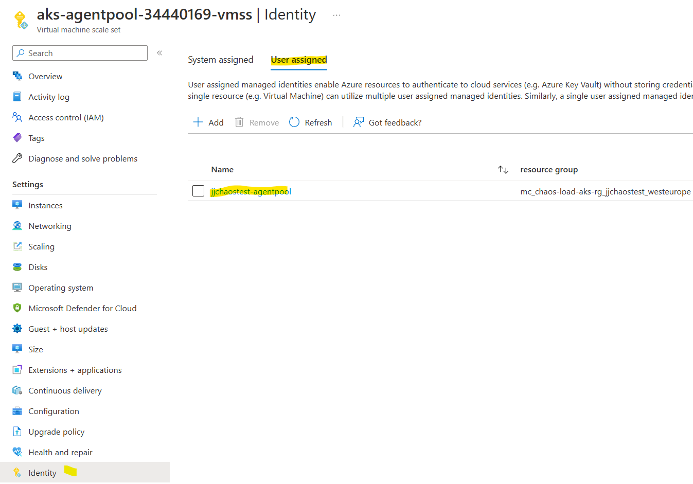
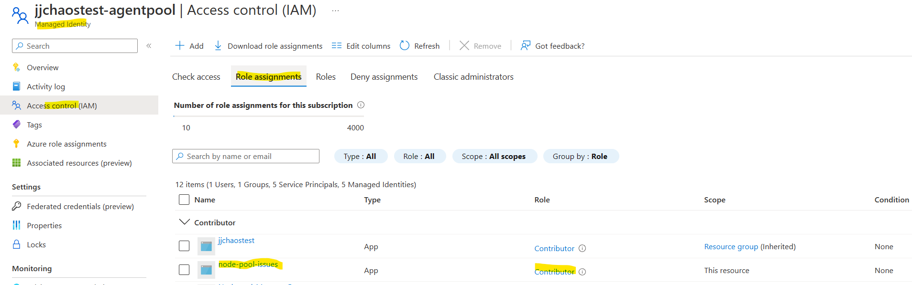
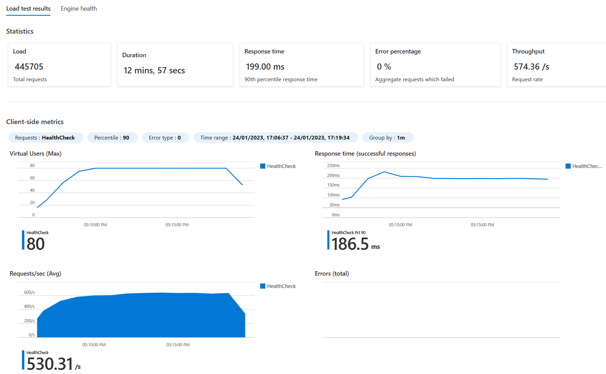
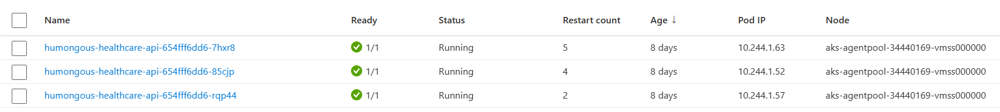

# Chaos Experiment Three

In this experiment we going to cause an issue with the node pool that the AKS cluster uses. We can then use our Azure Load Testing service to then run load tests:

1. before the experiment starts - to get a baseline
2. during the middle of a load test - to see how the experiment impacts a busy service
3. for the full duration of a load test - to get a better feel of the overall loss in performance

## Set up the Chaos Experiment

This chaos experiment uses the *VMSS Shutdown* fault. This allows you to designate the VMSS and how many of the instances in the pool get shutdown. 


This experiment only works well if there is more than one node in the node pool - otherwise the application (when on a single AKS cluster with a single node pool) will not work at all. A much more interesting experiment is a partial failure.

Permissions for the chaos experiment to amend the VMSS that underpins the node pool need to be setup. On experiment creation, the chaos experiment creates a user assigned managed identity which is then used by the chaos experiments to control the VMSS. This *role assignment* needs to be created, otherwise the chaos experiment will not have permissions to run the experiment.



In the above, the chaos experiment creates a user-assigned managed identity and associated this with the VMSS that is the AKS node pool. This identity is then used to give permissions to the individual chaos experiments.



In the above, the chaos experiment *node-pool-issues* is given *contributor* access to the user defined managed identity associated with the VMSS. This allows this specific chaos experiment to control the VMSS. If further chaos experiments need to act against the VMSS control plane, these need to be added to the managed identity as extra role assignments.

If when running an experiment on the VMSS you get an error of the form:
```
The resources='' referenced by the experiment could not be found due to insufficient permissions.
```
Then this is likely to be a permissions issue. See [Give experiment permission to your Virtual Machine](https://learn.microsoft.com/en-us/azure/chaos-studio/chaos-studio-quickstart-azure-portal#give-experiment-permission-to-your-virtual-machine)


## Set up the Load Test 

No need to setup the load test, but it is useful to use the feature in load test that allows you to comment a run, so for a specific load test the purpose of the run can be recorded for later.

## Perform test runs

You can check that the experiment is having an effect on the cluster by looking at the node pools part of the the AKS instance in the portal. It should show one of the node pools not being available:


How this impacts the pods really depends on how they have been scheduled. If they are scheduled across the node pool instances, such as below:


Then this means that when the experiment runs, then either 2 instances or 1 instance will need to be rescheduled to the remaining running node.


### Run one - before the chaos experiment starts

This is really optional as the baseline can be seen from previous chaos experiments.


### Run two - during a load test


In the above use case, there is not much to see. A few errors have crept in and the throughput does not look even, but not much to see.


### Run three - for the full duration of a load test



In the above, there is even less to see as it appears that the scheduler has already made sure all of the pods are on the one remaining node pool instance.




## Observations and Conclusions

This first conclusion that can be drawn is that in a two-node cluster, killing one node will not change the availability of the application.

But there is much more than this. What happens really depends on the scheduler, the deployment YAML's limits and what other workloads are competing for space on the cluster. If no limits are set, apart from not being good practice, it means that Kubernetes could schedule all replicas of the pod on the same node pool instance. If that node pool instance is killed during the chaos test, then they will be rescheduled onto the other node pool instance. 

Under more realistic conditions, the pods will have been scheduled across the node pool instances. Failure of one node pool instance, then means that either the workload will run with fewer instances or - if there is space that instance on the killed node pool instance will be rescheduled. Depending on the influence of the data tier, this may or may not have a noticable impact on the throughput of the application.


[Conclusions and future experiments](conclusion-future.md).


