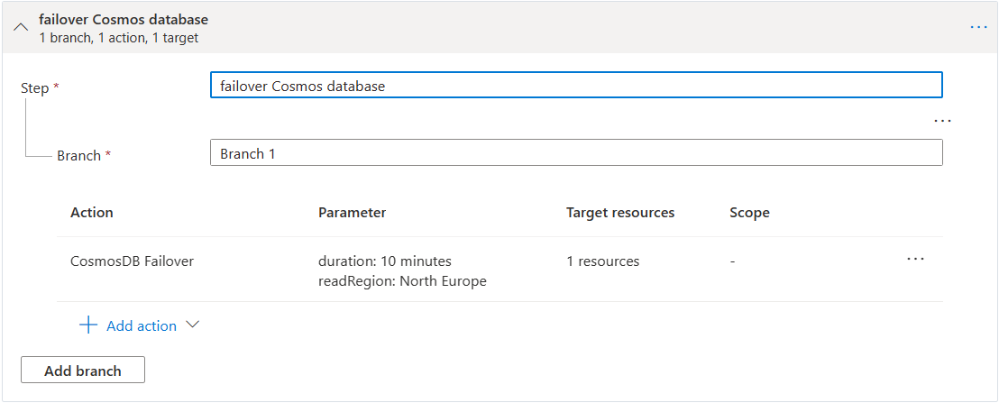
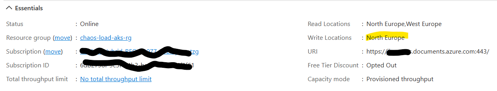
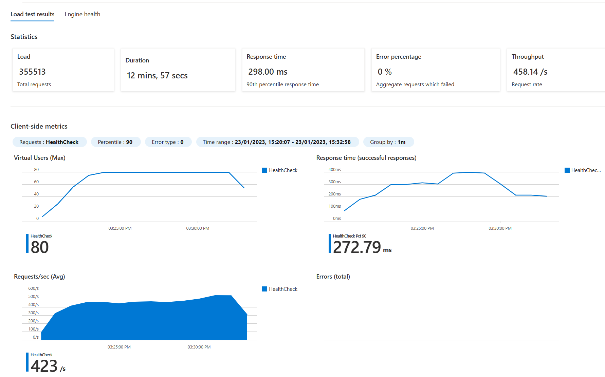
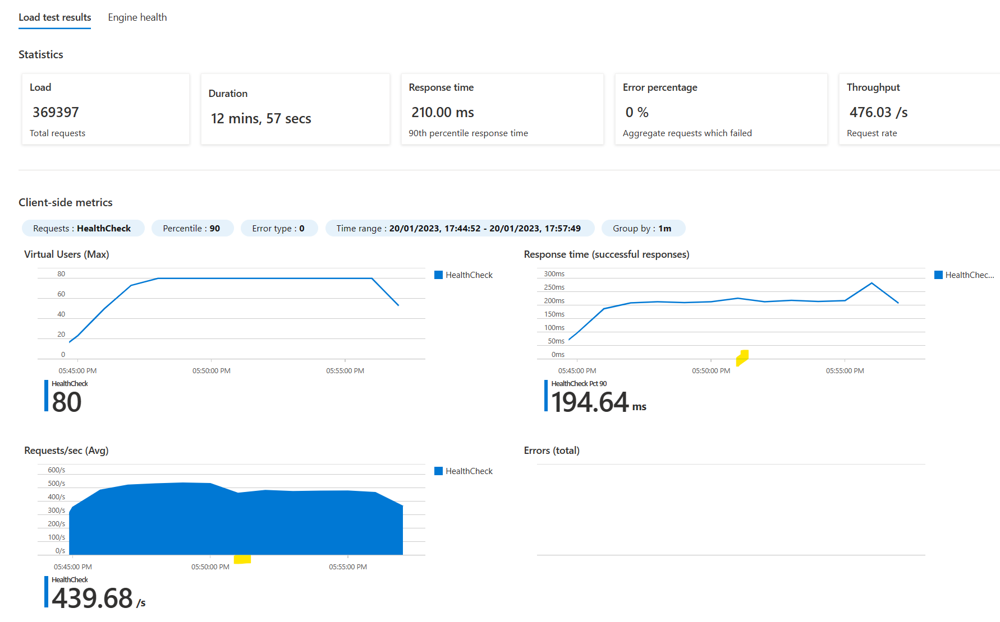
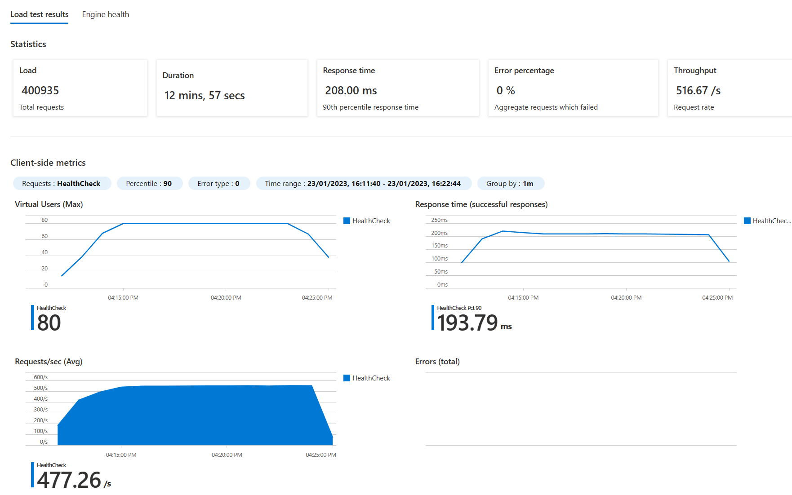
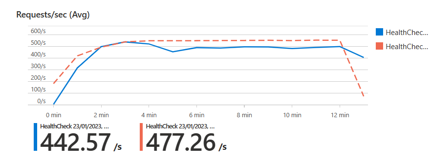

# Chaos Experiment Two

In this experiment we going to cause an issue with the Cosmos database. We can then use our Azure Load Testing service to then run load tests:

1. before the experiment starts - to get a baseline
2. during the middle of a load test - to see how the experiment impacts a busy service
3. for the full duration of a load test - to get a better feel of the overall loss in performance

The main chaos action for Cosmos is to perform a failover from one region to another.

## Set up the Chaos Experiment

Firstly the Cosmos database needs to be configured to replicate to another region. The initial region is still the read/write on, but there is an additional read-only reagion. 

It should be noted that for this experiment, we are not attempting to setup Cosmos as multi-master. That could be another experiment :-)

The chaos experiment needs to use the *Cosmos DB Failover Action* and this needs to be configured to point to the *read-only* region - that is the target region that to which the experiment will failover. If your Cosmos is in West Europe and the read replica in North Europe, then the experiment needs to be set to North Europe.

## Set up the Load Test 

No need to setup the load test, but it is useful to use the feature in load test that allows you to comment a run, so for a specific load test the purpose of the run can be recorded for later.

The load test is exaclty the same one for experiment one.

## Perform test runs

As can be seen in the above diagram, the write region gets changed during failover to one of the other read-only regions. In this case from *West Europe* to *North Europe*

### Run one - before the chaos experiment starts

### Run two - during a load test

### Run three - for the full duration of a load test

## Observations and Conclusions

In the above diagram, you can see that whilst the failed over Cosmos keeps working, the overall throughput is a little lower as it is in a different region to its AKS cluster when failed over.

[Experiment three](experiment-three.md)
